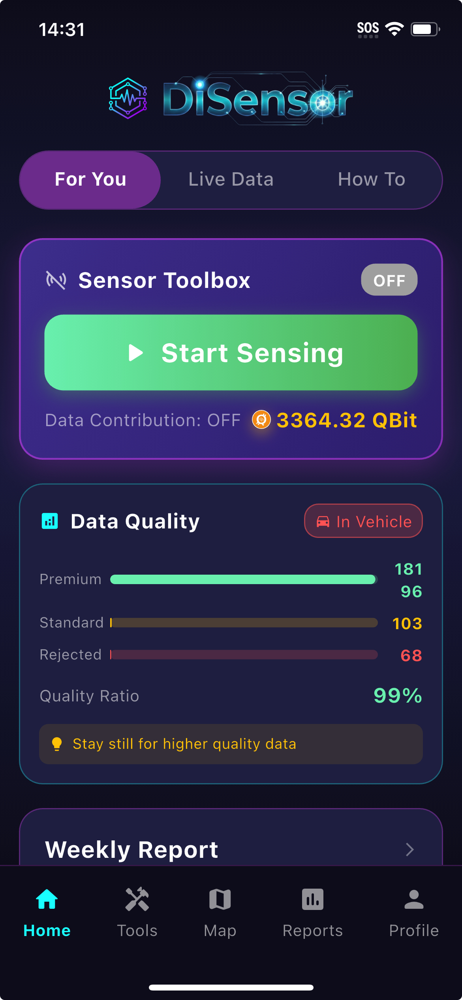
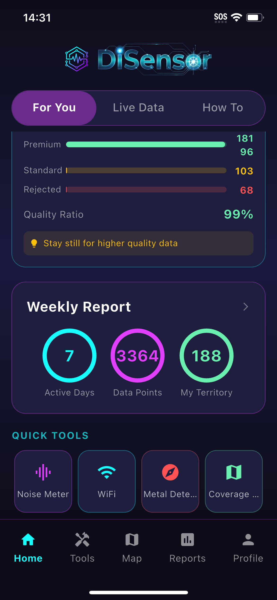
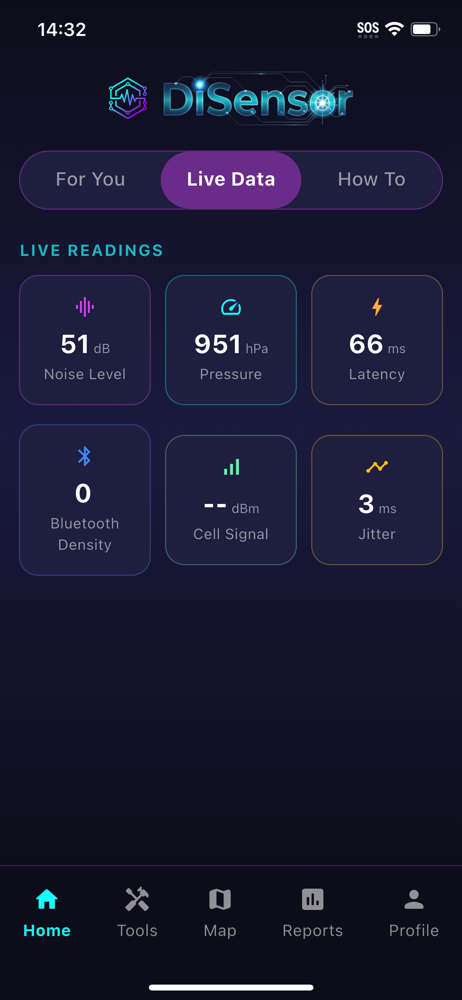
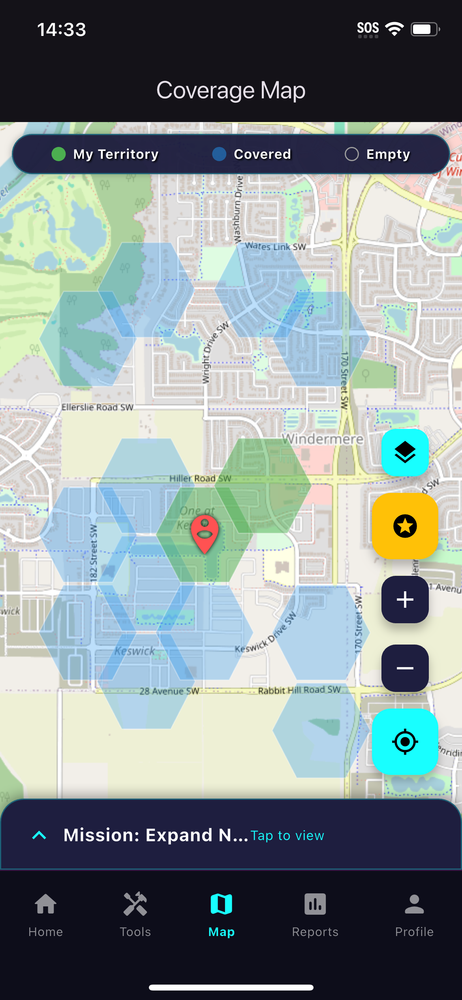
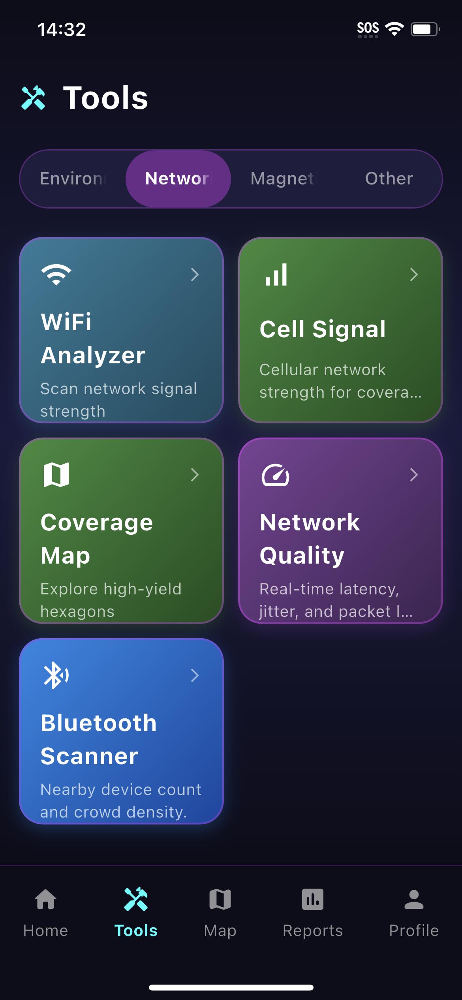
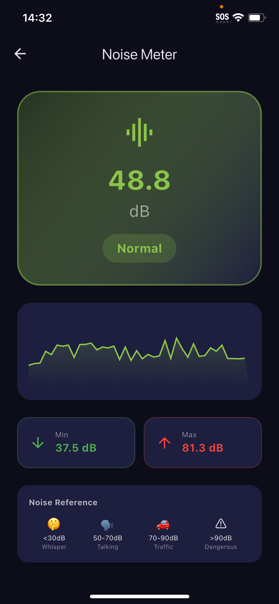
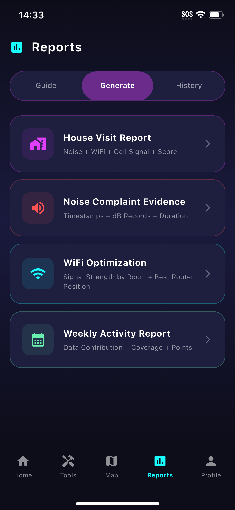
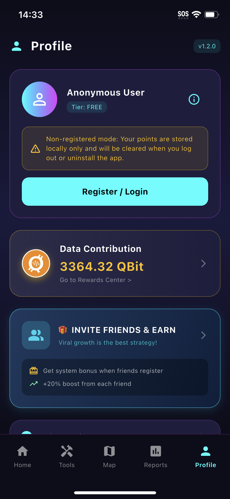

# SmartSensor Network

**A production-ready Flutter template for building crowdsourced sensor data collection networks with gamification, real-time dashboards, and cloud synchronization.**


## Overview

SmartSensor Network leverages idle smartphone resources to passively collect environmental sensor data while users go about their daily lives. The app transforms routine activities—commuting, walking, working—into valuable data contribution opportunities, rewarding users with points that can be redeemed for real rewards.

## Screenshots

<p align="center">
  
  
  
  
</p>
<p align="center">
  
  
  
  
</p>

## Features

### Multi-Sensor Data Collection
| Sensor | iOS | Android |
|--------|:---:|:-------:|
| Noise Meter (with waveform) | ✅ | ✅ |
| Magnetometer / Metal Detector | ✅ | ✅ |
| Barometer (Altitude/Pressure) | ✅ | ✅ |
| Light Sensor | ⚠️ | ✅ |
| Bluetooth Scanner | ✅ | ✅ |
| Cellular Signal | ⚠️ | ✅ |
| Network Quality | ✅ | ✅ |
| Step Counter | ✅ | ✅ |
| WiFi Analyzer | ❌ | ✅ |

### H3 Hexagonal Coverage Mapping
- Uber H3 spatial indexing for location-based data organization
- Interactive coverage map showing explored territories
- Visual representation of data contribution coverage
- Mission system encouraging exploration of new areas

### Gamification & Rewards
- Points earned for data contributions
- Referral system with bonus rewards for inviting friends
- Redeemable rewards (gift cards, premium features)
- Achievement tracking ready

### Background Data Collection
- Automatic passive data collection using device idle time
- Motion detection to ensure data quality (stationary vs. moving)
- Intelligent data filtering and quality scoring
- Offline storage with automatic sync when connected

### Cloud Backend (Supabase)
- Real-time data synchronization
- User authentication (Email, Google, Apple, GitHub, WeChat)
- Secure data storage with row-level security
- RESTful API for data access

### PDF Report Generation
- Generate detailed sensor data reports
- Weekly/monthly summaries
- Shareable PDF export

### Internationalization
- English and Chinese (Simplified) support
- Easy to extend for additional languages

## Tech Stack

- **Frontend**: Flutter 3.x, Dart, Provider
- **Backend**: Supabase (Auth, Database, Realtime)
- **Maps**: Flutter Map, H3-Dart
- **Error Tracking**: Sentry (optional)

## Getting Started

### Prerequisites

- Flutter SDK 3.x
- Dart SDK 3.x
- A Supabase project
- Xcode (for iOS)
- Android Studio (for Android)

### Installation

1. **Clone the repository**
   ```bash
   git clone https://github.com/yourusername/smartsensor-network.git
   cd smartsensor-network
   ```

2. **Install dependencies**
   ```bash
   flutter pub get
   ```

3. **Configure Supabase**
   
   Create the required tables in your Supabase project. See `/supabase/*.sql` for schema examples.

4. **Run the app**
   ```bash
   flutter run --dart-define=SUPABASE_URL=your_url --dart-define=SUPABASE_ANON_KEY=your_key
   ```

### Build for Production

```bash
# Android
flutter build apk --dart-define=SUPABASE_URL=... --dart-define=SUPABASE_ANON_KEY=...

# iOS
flutter build ios --dart-define=SUPABASE_URL=... --dart-define=SUPABASE_ANON_KEY=...
```

## Project Structure

```
lib/
├── core/                    # Core services and utilities
│   ├── auth_service.dart    # Authentication logic
│   ├── sensor_manager.dart  # Sensor data management
│   ├── data_sync_service.dart
│   ├── app_strings.dart     # Localization
│   └── ...
├── features/                # Feature pages/screens
│   ├── home_page.dart
│   ├── noise_meter_page.dart
│   ├── magnetometer_page.dart
│   ├── hex_map_page.dart
│   └── ...
└── main.dart               # App entry point

supabase/                   # Database schemas
screenshots/                # App screenshots
```

## Configuration

### Environment Variables

| Variable | Required | Description |
|----------|:--------:|-------------|
| `SUPABASE_URL` | ✅ | Your Supabase project URL |
| `SUPABASE_ANON_KEY` | ✅ | Your Supabase anon/public key |
| `SENTRY_DSN` | ❌ | Sentry DSN for error tracking |

## License

MIT License - Free for personal and commercial use.

## Contributing

Contributions are welcome! Please feel free to submit a Pull Request.

---

**Built with Flutter**
